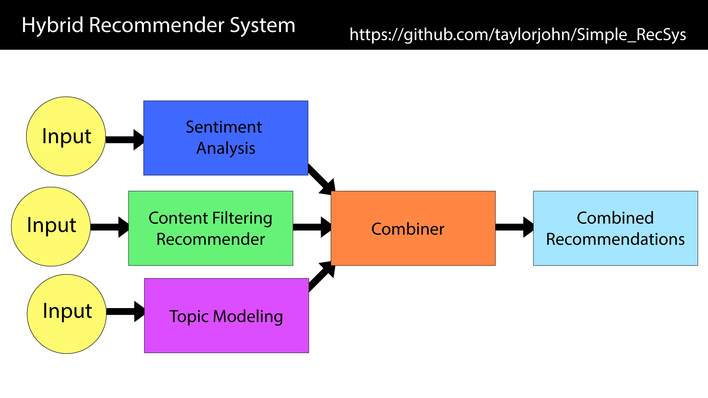

# Simple_RecSys


# Simple Hybrid Cold Start Recommender System


###### Now to Combine the 3 all together

# Hybrid Recommender System

  - Recommender System
  - Sentiment Anaylysis
  - Topic Modeling

What started out as a simple category based recommender system has since grown into a hybrid system which I believe could possibly bring more life into the results. Which alread make sense from a categorical sense but I belive can be improved using both topic modeling and sentiment analysis.

###### Note: Cold Start means this system will not collect data from users and will only use data from the character features unlike regular recommender systems that may use voting or user interaction information to influence the results.

# First we get the outcomes of each indivual systems


# Now to Combine the outcomes of each indivual system and sort and recommend the new hybrid results




##  1. Simple Category Based Cold Start Recommender System


The Simple Recommender System takes the categorial features from the dataframe which has the character's features.


# character's features

  - character's name (must be unique)
  
  - herotype (can only have one of following choices)
  
      - Bard
      - Sorcerer
      - Paladin
      - Rogue
      - Druid
      - Sorcerer
      
  - weapons (can have one or multiple of following choices)
  
        - Dagger
        - sling
        - club
        - light crossbow
        - battleaxe
        - Greataxe
        
  - spells (can have one or multiplee of following choices)
  
          - Transmutation
          - Enchantment 
          - Necromancy 
          - Abjuration
          - Conjuration
          - Evocation
          
  - background story (should be unique)
  
  
  
 I used get dummies to convert possable combonations of weapons and spells into zeros and ones 

##  2. Simple Sentiment Anaylysis


The Simple Sentiment Anaylysis takes the background text from the dataframe which is the content about a character's background story.  It first removes stop word and tokens words.

It uses nltk vader SentimentIntensityAnalyzer to get a polarity score of the character background score.

```
example = "You learned early on that people are gullible and easy to exploit. You decided to turn your natural lucky streak into the basis of a career, though you still realize that improving your skills is essential.You made a friend of an adventurer. Thomony Keldingfie, Neutral Human Bard that works as a Priest. Your relationship was indifferent. He is alive and well. You made a friend of an adventurer. Chad Browbridge, Neutral Evil Human Paladin that works as an Artisan. Your relationship was friendly. He is alive and well. You started dating. Gerald Blythe, Neutral Human Bard that works as an Explorer/Wanderer. Your relationship was friendly. He is alive, but doing poorly due to injury / finances / relationship."
```

```
sid.polarity_scores(a)
```
would output a score of
```
{'neg': 0.082, 'neu': 0.706, 'pos': 0.212, 'compound': 0.8705}
```

I then take the score if it is positive it gets a pos label if it is negative it gets a neg label.

```
df['comp_score'] = df['compound'].apply(lambda score: 'pos' if score>=0 else 'neg')
```

##  3. Simple Topic Modeling


The Simple Topic Modeling takes the background text from the dataframe which is the content about a character's background.  It first removes stop word and tokens words and finds 15 words to make a cluster to become a topic.

Below is a example of 15 words in topic #0

```
The Top 15 words Per topic # 0
['friendly', 'alive', 'relationship', 'works', 'human', 'friend', 'adventurer', 'neutral', 'instantly', 'musical', 'discovered', 'day', 'picked', 'play', 'instrument']
```

After I got all the topics I created a dictionary to label the tpoics based on my best guess as to what the topic was. Then I display them grouped by Topic label the by name to display them semi orginaized.

The results came out nice and varied with a good balance of topics.


##  4. Simple Dummy Data For Above


I have also completed this.

The File is a excell file that include all the data needed to do a simple test to make sure everything works as needed.
> Short blurb about what your product does.

The Simple Recommender System takes the categorial feaeature from the dataframe which has the character's features.


# This excel file contains all the character's features

  - character's name (must be unique)
  
  - herotype (can only have one of following choices)
  
      - Bard
      - Sorcerer
      - Paladin
      - Rogue
      - Druid
      - Sorcerer
      
  - weapons (can have one or multiple of following choices)
  
        - Dagger
        - sling
        - club
        - light crossbow
        - battleaxe
        - Greataxe
        
  - spells (can have one or multiplee of following choices)
  
          - Transmutation
          - Enchantment 
          - Necromancy 
          - Abjuration
          - Conjuration
          - Evocation
          
  - background story (should be unique)
  


## Installation

open your terminal and navigate to the directory where you would like to save your notebook. Then type the command jupyter notebook and the program will instantiate a local server at localhost:8888 (or another specified port). 


##  launch a Jupyter notebook

```
jupyter notebook
```


##  Open Notebook


If you already have a Jupyter Notebook in your current directory that you want to view, find it in your files list and click it to open. 

```
dnd-rec.ipynb
```


## Usage example

TBA - A few motivating and useful examples of how your product can be used. Spice this up with code blocks and potentially more screenshots.

_For more examples and usage, please refer to the [Wiki][wiki]._

## Development setup

TBA - Describe how to install all development dependencies and how to run an automated test-suite of some kind. Potentially do this for multiple platforms.

```sh
make install
npm test
```

## Release History

* 0.0.1
    * Work in progress

## Meta

Your Name – [@YourTwitter](https://twitter.com/dbader_org) – YourEmail@example.com

Distributed under the XYZ license. See ``LICENSE`` for more information.

[https://github.com/taylorjohn/Simple_RecSys](https://github.com/taylorjohn/)

## Contributing

1. Fork it (<https://github.com/taylorjohn/Simple_RecSys/fork>)
2. Create your feature branch (`git checkout -b feature/fooBar`)
3. Commit your changes (`git commit -am 'Add some fooBar'`)
4. Push to the branch (`git push origin feature/fooBar`)
5. Create a new Pull Request


I am trying to find the 3 most similar to a name by sorting combinations of a 2 set of dummies(get_dummies) plus a column. Or find the name of the top 3 matchings (most in common) of the combinations of column data - herotype, weapons, and spells.

# Data that we have

  - name 
  - herotype
  - weapons
  - spells
  - backgroundstory
  
  ```
name	               type	      weapons	                                           spells
------------------------------------------------------------------------------------------------------------------------------
bam	                 Bard	      Dagger, sling, club	                               Transmutation, Enchantment 
niem	               Sorcerer	  light crossbow, battleaxe	                         Necromancy 
aem	                 Paladin	  Greataxe	                                         Abjuration, Conjuration
yaeks	               Rogue	    club, battleaxe	                                   Conjuration, Evocation, Transmutation
jeeks	               Druid	     Dagger, Greataxe	                                 Evocation, Transmutation, Necromancy 
aez	                 Sorcerer	   club, light crossbow	                             Evocation, Enchantment 
sax	                 Bard	       light crossbow, battleaxe, Dagger, sling, club    Necromancy 
eert	               Bard	       Greataxe	                                         Transmutation, Necromancy 
wuc	                 Sorcerer	   light crossbow, battleaxe	                       Necromancy 
yac	                 Sorcerer    Greataxe	                                         Conjuration, Evocation, Transmutation
Jocelyn Churchill    Paladin	   club	                                             Evocation, Enchantment 
Robert Perry	       Rogue	     Dagger, sling, club	                             Abjuration, Conjuration
Tim Carlton	         Rogue	     light crossbow, sling	                           Necromancy 
Rolf Rylan	         Paladin	   light crossbow, battleaxe	                       Necromancy 
Manfred Watsons	     Rogue	     Greataxe	                                         Evocation, Enchantment 
```

I made a simple data frame example using some random DnD data.

I have a data frame loaded from CSV it has the id a name, herotype, weapons, and spells.

name there is only one so its unique

herotype can only be one choice but many names can have the same herotype

weapons a name can have one or many combinations weapons

spells a name can also have one or many combinations weapons

Now that I got the Simple recommender to work

# Data that we discovered

I Decide to take the background stories and get 7 topics to group them by to add a extra level that brings in there background story.

```

for index, topic in enumerate(nmf_model.components_):

    print(f"The Top 15 words Per topic # {index}")

    print([tfidf.get_feature_names()[i] for i in topic.argsort()[-15:]])

    print(f"\n")

The Top 15 words Per topic # 0
['friendly', 'alive', 'relationship', 'works', 'human', 'friend', 'adventurer', 'neutral', 'instantly', 'musical', 'discovered', 'day', 'picked', 'play', 'instrument']

```
